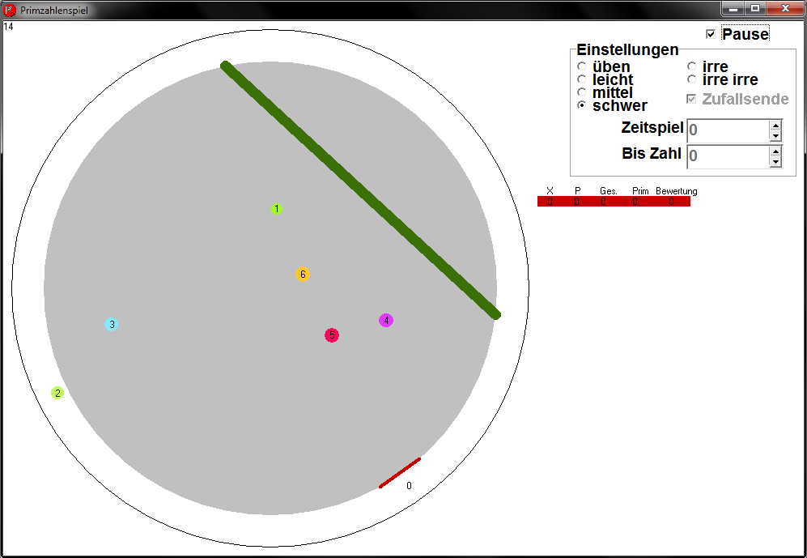

primzahlenspiel
===============

Ein Spiel zum lernen, das man lange spielen kann.

[Hier kann man das Spiel runterladen](https://github.com/niccokunzmann/primzahlenspiel/raw/master/primzahlenspiel.exe)

Ziel ist es, die Primzahlen den Rand erreichen zu lassen und alle Nicht-Primzahlen abzublocken oder aufzuspießen. 
Es gibt verschiedene Schwierigkeitsgrade. Man kann es allein mit drehendem Spielfeld oder mit sehr vielen anderen spielen.
Leertaste = Pause.

Herausforderungen:

- man steuert die Beschleunigung, muss also etwas nachdenken. Mit etwas Übung kann man damit aber coolere Moves machen als mit der Geschwindigkeitssteuerung.

Nicht aufgeben!

- Man hat vielleicht mal Minuspunte aber kommt man wieder schnell nach vorn und an erste Stelle, wenn man nicht aufgibt, da sie Zahlen immer höher werden.

